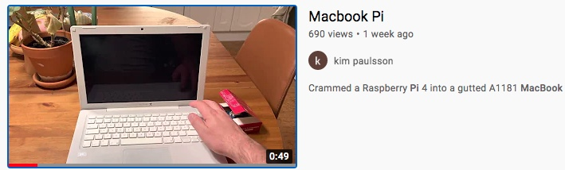

# littlespleen.github.io
Raspberry Pi 4 powered laptop

# Keyboard and trackpad
[Keyboard and trackpad](keyboard.md)

# LCD controller M.NT68676.2

[LCD controller](lcdcontroller.md)

# Booting the thing

# Todo / Open issues
1. Have not yet connected the old USB ports / Ethernetport. Have to make room for a USB hub
2. Add second Lithium Cell
3. Need to connect the speakers to the audio out on the lcd driver board.
4. Charging USB-C is working but need to switch of the RPI casue the power drops too low.
    - Also when USB-C is connected the powerbank IC shuts the power for a short time.
    - Will add some capacitor/batttery to survive a charge cable connect
5. Micro SD extender is glitchy not reliable.

# List of hardware components

Sorry for swedish links

# powerbank
[https://www.amazon.se/ADDTOP-Powerbank-kraftf%C3%B6rs%C3%B6rjning-kompatibel-Nintendo/dp/B088BZW3SD/](https://www.amazon.se/ADDTOP-Powerbank-kraftf%C3%B6rs%C3%B6rjning-kompatibel-Nintendo/dp/B088BZW3SD/)

# voltage booster
[https://www.amazon.se/gp/product/B07BVWV74J/ref=ppx_yo_dt_b_asin_image_o03_s01?ie=UTF8&psc=1](https://www.amazon.se/gp/product/B07BVWV74J/ref=ppx_yo_dt_b_asin_image_o03_s01?ie=UTF8&psc=1)

# sd micro extender
[https://www.amazon.se/gp/product/B07KPTXMX8/ref=ppx_yo_dt_b_asin_title_o00_s00?ie=UTF8&psc=1](https://www.amazon.se/gp/product/B07KPTXMX8/ref=ppx_yo_dt_b_asin_title_o00_s00?ie=UTF8&psc=1)

# lcd controller
[https://www.aliexpress.com/item/33050193314.html?spm=a2g0s.9042311.0.0.426a4c4dWtuSUb](https://www.aliexpress.com/item/33050193314.html?spm=a2g0s.9042311.0.0.426a4c4dWtuSUb)

# usb-c breakout
[https://www.electrokit.com/produkt/anslutningskort-usb-c/](https://www.electrokit.com/produkt/anslutningskort-usb-c/)

Early progress

Cutting the main logicboard to use USB ports and ehternetport

Powerbank internals

Early test

